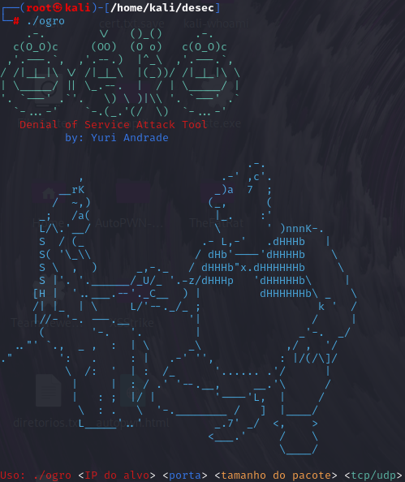

# OGRO
Denial of Service Tool (BASIC)

<p align="center">
    
</p>

## Sobre a Ferramenta

OGRO é uma poderosa ferramenta desenvolvida em C para testes de estresse e negação de serviço (DoS). Sua funcionalidade principal é simular ataques de negação de serviço para avaliação de robustez e resiliência em ambientes controlados.  
**Nota:** Utilize a ferramenta de forma ética e somente em sistemas onde você possui autorização explícita.

## Funcionalidades

- Simulação de ataques de negação de serviço com alto desempenho.
- Suporte a diferentes vetores de ataque configuráveis.
- Código otimizado em C para máximo aproveitamento de recursos.

## Uso

1. Clone o repositório:  
   ```bash
   git clone https://github.com/yuriandrad/ogro.git
   cd ogro
2. Compile o código:  
   ```bash
   gcc ogro.c -o ogro
3. Execute com os parâmetros desejados: 
   ```bash
   ./ogro <alvo> <porta> <parâmetros>

Demonstração
<p align="center"> <video src="ogro2.mp4" controls width="700"></video> </p>
Aviso Legal
OGRO foi projetada para fins educacionais e de pesquisa em segurança da informação. Qualquer uso indevido que viole leis ou regulamentações locais é de responsabilidade exclusiva do usuário.
<p align="center"> Feito com ❤️ para a comunidade de Segurança da Informação. </p> ```
